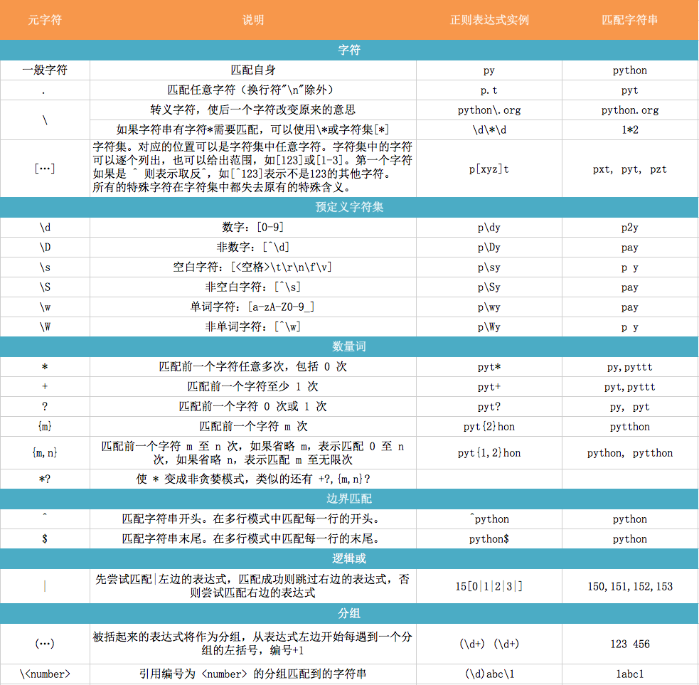

# Python 正则表达式

## PART 1: 正则表达式基础



## PAER 2: python 正则函数

### re.match(regex, str)
判断是否匹配，若成功返回Match对象，否则返回None
```python
test = '010-122345'
if re.match(r'^\d{d}[-]\d{5}$', test):
    print('success!')
else:
    print('fail!')
```

